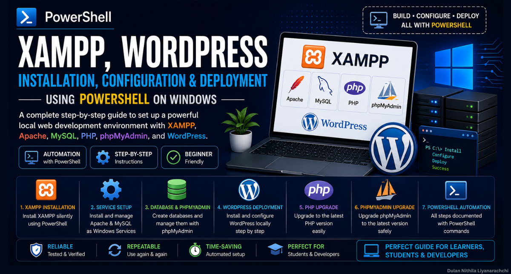

# Complete Guide to XAMPP Installation, Service Setup, Configuration, and WordPress Deployment using PowerShell

> A comprehensive step-by-step guide for installing XAMPP, configuring Apache and MySQL as Windows services, deploying WordPress, and upgrading PHP and phpMyAdmin using Windows PowerShell.



---

## 📖 Overview

This repository contains a complete guide for setting up a local web development environment using **XAMPP** on **Windows**. The guide demonstrates how to perform the entire installation and configuration process using **PowerShell commands**, making it ideal for students, beginners, and anyone learning Windows server administration or WordPress deployment.

The guide covers everything from installing XAMPP to deploying WordPress and upgrading PHP and phpMyAdmin while managing services entirely through PowerShell.

---

## ✨ Features

- Complete XAMPP installation
- Silent installation using PowerShell
- Apache Service installation
- MySQL Service installation
- WordPress deployment
- Database creation using phpMyAdmin
- PHP version upgrade
- phpMyAdmin upgrade
- Apache configuration
- Service management with PowerShell
- Localhost configuration
- Verification and troubleshooting steps
- Beginner-friendly instructions

---

## 📚 Guide Contents

- XAMPP Installation
- Apache Service Installation
- MySQL Service Installation
- WordPress Installation and Configuration
- PHP Upgrade
- phpMyAdmin Upgrade
- Service Verification
- Configuration Updates
- Troubleshooting
- References

---

## 🛠 Technologies Used

- Windows PowerShell
- XAMPP
- Apache Server
- MySQL
- PHP
- phpMyAdmin
- WordPress

---

## 📋 Prerequisites

Before following this guide, ensure you have:

- Windows 10 or Windows 11
- Administrator privileges
- PowerShell
- Stable Internet connection
- Basic knowledge of Windows commands

---

## 🚀 What You Will Learn

After completing this guide, you will be able to:

- Install XAMPP using PowerShell
- Configure Apache as a Windows Service
- Configure MySQL as a Windows Service
- Start and stop Windows services
- Create and manage WordPress databases
- Configure phpMyAdmin
- Deploy WordPress locally
- Upgrade PHP versions
- Upgrade phpMyAdmin
- Manage a local WordPress development environment

---

## 📂 Repository Structure

```
.
├── Complete Guide.pdf
├── Cover.png
├── Powershell Commands.md
├── README.md
```

---

## 📄 Guide

The complete guide is available in:

**[Complete Guide.pdf](./Complete%20Guide.pdf)**

It contains detailed instructions with screenshots and PowerShell commands for every step of the installation and configuration process.
<br>The powershell commands is also there as a seperate file with the name Powershell Commands.md

---

## 🎯 Intended Audience

This guide is suitable for:

- Students
- Beginners learning web development
- WordPress developers
- Software engineering students
- System administrators
- DevOps beginners
- IT instructors
- Self-learners

---

## 💡 Skills Demonstrated

- Windows Server Administration
- PowerShell Automation
- Apache Configuration
- MySQL Administration
- PHP Configuration
- WordPress Deployment
- Local Development Environment Setup
- Software Installation Automation
- Web Server Configuration
- System Troubleshooting

---

## 📌 Software Covered

- XAMPP
- Apache Server
- MySQL
- PHP
- phpMyAdmin
- WordPress

---

## 📖 References

The guide references official resources including:

- Apache Friends
- WordPress
- PHP for Windows
- phpMyAdmin
- SourceForge
- Google
- ChatGPT

(See the References section in **Guide.pdf** for the complete citations.)

---

## 🤝 Contributing

Contributions, suggestions, corrections, and improvements are welcome.

If you find any issues or have ideas to improve the guide, feel free to open an issue or submit a pull request.

---

## ⚠️ Disclaimer

This repository is intended solely for educational and study purposes. It contains documentation and step-by-step instructions created to assist students and learners in understanding the installation, configuration, and deployment of XAMPP, Apache, MySQL, PHP, phpMyAdmin, and WordPress in a local development environment.

The information provided is shared in good faith and should be used responsibly. Any software, trademarks, product names, or logos referenced in this repository remain the property of their respective owners.

This repository does not redistribute proprietary software, installers, binaries, or modified versions of any software. Users are responsible for downloading all required software from their respective official websites and complying with their applicable licenses and terms of use.

Use this guide at your own risk. The author is not responsible for any data loss, system issues, or other damages resulting from the use of this documentation.

---

## 👨‍💻 Author

**Dulan Nithila Liyanarachchi**

- Undergraduate Researcher
- Web and Software Developer
- Cybersecurity Enthusiast

**Portfolio:** https://nithilald.github.io/Dulan-Nithila-Liyanarachchi/

**GitHub:** https://github.com/NithilaLD

**LinkedIn:** https://www.linkedin.com/in/dulan-nithila-liyanarachchi-563a7121a/

---

## ⭐ Support

If you found this repository helpful, consider giving it a ⭐ to support the project.
